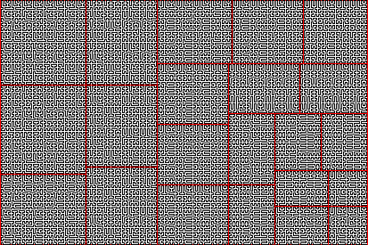

Psuedo-Hilbert curves in treemaps
=================================

This package provides functions for plotting pseudo-Hilbert curves in treemaps. A Hilbert curve maps one dimensional space into two dimensions while minimising the two-dimensional distance between points that were adjacent in one dimension. A Hilbert curve must be plotted inside a square with side lengths equal to a power of 2. A pseudo-Hilbert curve can be plotted in a rectangle with slight penalties to the minimised distances. A treemap displays hierarchical data as a set of nested rectangles. Each branch of the tree is given a rectangle, which is then tiled with smaller rectangles representing sub-branches. A leaf node's rectangle has an area proportional to a specified dimension of the data.

Usage
-----

To get a vanilla Hilbert curve use the `hilbert` function.

```{r}
par(mar = rep(0, 4), xaxs = 'i', yaxs = 'i')
plot(hilbert(512), type='l')
```


To get a pseudo-Hilbert curve use the `pseudo.hilbert` function.

```{r}
par(mar = rep(0, 4), xaxs = 'i', yaxs = 'i')
plot(pseudo.hilbert(1240, 1024), type='l')
```


To see an example of a pseudo-Hilbert curve in a treemap run the demo


